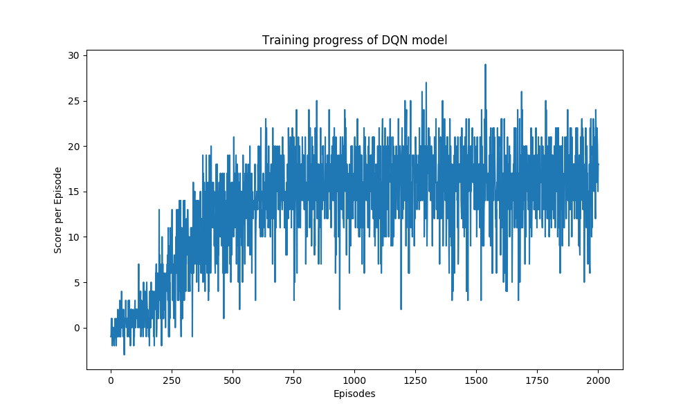

# Report

### Learning Algorithm

#### DQN Agent
- file: `agent.py`
- class: `NavigationAgent`

The `DQN` agent class is implemented, as described in the Deep Q-Learning algorithm. It provides several methods :
- **constructor** :
    - Initialize the memory buffer (Replay Buffer)
    - Initialize 2 instance of the Neural Network : the target network and the local network
- **step()** :
    Allows to store a step taken by the agent (state, action, reward, next_state, done) in the Replay Buffer/Memory Every 4 steps (and if their are enough samples available in the Replay Buffer), update the target network weights with the current weight values from the local network (That's part of the Fixed Q Targets technique)
- **act()** which returns actions for the given state as per Epsilon-greedy selection so that to balance between exploration and exploitation for the Q Learning
- **learn()** which update the Neural Network value parameters using given batch of experiences from the Replay Buffer.

#### Replay buffer
- file: `agent.py`
- class: `ReplayBuffer`

The ReplayBuffer class implements a fixed-size buffer to store experience tuples (state, action, reward, next_state, done)
- **add()** allows to add an experience step to the memory
- **sample()** allows to randomly sample a batch of experience steps for the learning

#### Network architecture
- file: `model.py`
- class: `NavigationModel`

`NavigationModel` is a simple fully-connected Deep Neural Network. The network has two hidden `nn.Linear` layers.
```python
def forward(self, state):

    x = F.relu(self.bn1(self.fc1(state)))
    x = F.relu(self.bn2(self.fc2(x)))

    return self.actions(x)
```
where
- fc1 = `nn.Linear(state_size, 64)`
- fc2 = `nn.Linear(64, 32)`
- actions = `nn.Linear(32, action_size)`
- bn* = `nn.BatchNorm1d`
- relu = Rectified Linear Unit

#### Hyperparameters
The **DQN agent** uses the following parameters values (defined in `agent.py`)
- **BUFFER_SIZE** = int(1e5)  # replay buffer size
- **BATCH_SIZE** = 64         # minibatch size 
- **GAMMA** = 0.99            # discount factor 
- **TAU** = 0.001             # for soft update of target parameters
- **LR** = 5e-4               # learning rate 
- **UPDATE_EVERY** = 4        # how often to update the network

### Logs

#### Plot of rewards


#### Output log
```
Found path: /home/pestipeti/Work/Udacity/Nanodegrees/Reinforcement Learning/UdacityDRLNavigation/./Banana_Linux/Banana.x86_64
Mono path[0] = '/home/pestipeti/Work/Udacity/Nanodegrees/Reinforcement Learning/UdacityDRLNavigation/./Banana_Linux/Banana_Data/Managed'
Mono config path = '/home/pestipeti/Work/Udacity/Nanodegrees/Reinforcement Learning/UdacityDRLNavigation/./Banana_Linux/Banana_Data/MonoBleedingEdge/etc'
Preloaded 'ScreenSelector.so'
Preloaded 'libgrpc_csharp_ext.x64.so'
Unable to preload the following plugins:
        ScreenSelector.so
        libgrpc_csharp_ext.x86.so
Logging to /home/pestipeti/.config/unity3d/Unity Technologies/Unity Environment/Player.log
INFO:unityagents:
'Academy' started successfully!
Unity Academy name: Academy
        Number of Brains: 1
        Number of External Brains : 1
        Lesson number : 0
        Reset Parameters :
                
Unity brain name: BananaBrain
        Number of Visual Observations (per agent): 0
        Vector Observation space type: continuous
        Vector Observation space size (per agent): 37
        Number of stacked Vector Observation: 1
        Vector Action space type: discrete
        Vector Action space size (per agent): 4
        Vector Action descriptions: , , , 
Episode 100 average score: 0.30
Episode 200 average score: 2.04
Episode 300 average score: 5.52
Episode 400 average score: 9.97
Episode 500 average score: 12.37
Environment solved in 556 episodes. Average score of last 100 episodes: 13.03
Episode 600 average score: 13.17
Episode 700 average score: 15.21
Episode 800 average score: 15.44
Episode 900 average score: 15.80
Episode 1000 average score: 15.65
Episode 1100 average score: 15.61
Episode 1200 average score: 16.11
Episode 1300 average score: 16.57
Episode 1400 average score: 16.17
Episode 1500 average score: 16.11
Episode 1600 average score: 15.84
Episode 1700 average score: 14.95
Episode 1800 average score: 16.15
Episode 1900 average score: 16.29
Episode 2000 average score: 16.43
```

### Ideas for Future Work
- Investigation of the hyperparameters such as learning rates and batch sizes.
- Double DQN
- Dueling DQN
- Prioritized experience replay